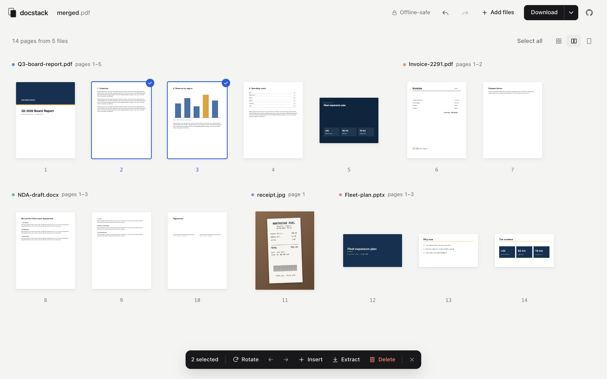
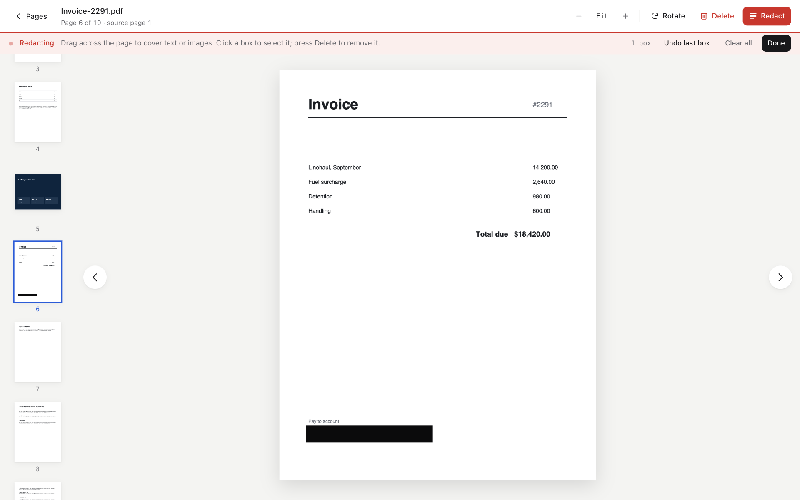

# docstack

**Merge and arrange PDFs, privately.** Combine PDFs, images, PowerPoint and Word files into one PDF, then reorder, rotate, delete, insert and redact pages right in your browser. Nothing is uploaded: every file is read, converted and written on your device.

[docstack.tools](https://docstack.tools)



## Features

**Arrange pages**
- Drop in several PDFs and see every page at once, grouped by the file it came from.
- Add PowerPoint and Word files: they are converted to PDF on your device, with selectable text, and their slides or pages join the rest.
- Add images too: each becomes a page you can arrange, rotate and redact like any other. Photos keep their full resolution and are turned upright if the camera saved them sideways.
- Drag pages to reorder them, including several selected pages at once and between files.
- Select like a file manager: click, <kbd>⌘</kbd>/<kbd>Ctrl</kbd>‑click, <kbd>Shift</kbd>‑click, or drag a box around pages.
- Rotate, delete, move to the start or end, or extract just the selected pages as their own PDF.
- Insert a PDF, an image or a blank page anywhere. Blank pages match the size of the pages around them.
- Drop new files exactly where you want them: a line shows where they will land.

**What you can add**

| | File types | Notes |
|---|---|---|
| PDFs | `.pdf` | Password-protected PDFs open once you enter the password. |
| Images | JPG, PNG, WebP, GIF, BMP, AVIF | One page per image. |
| PowerPoint | `.pptx`, `.ppt`, `.odp` | Converted on your device. Fonts that are not available are replaced with close matches, so check the result. |
| Word | `.docx`, `.doc`, `.odt`, `.rtf` | Same as PowerPoint. |
| Not converted | Excel, Numbers, Keynote, Pages | Export these as PDF from their own app first; docstack tells you how when you drop one. A spreadsheet rarely fits a page well, so Excel's own export, where you choose the print area and scaling, gives a better result. |

The first time you add a PowerPoint or Word file, docstack downloads the tool that converts it (about 50 MB, so it can take a moment on a slow connection). Your browser keeps it saved, so later files convert in seconds.

**Preview and redact**
- Open any page full-window, with a thumbnail strip, zoom, rotate and delete. Drag pages in the strip to reorder them without leaving the preview, or type a page number to move a page straight there.
- Redact by drawing boxes over text or images. Each box can be selected and removed, and thumbnails show exactly what will be covered.
- Redacted pages are exported as images, so the covered content cannot be selected, copied or recovered.

**Built to be safe to use**
- Undo and redo for every change, with an Undo button on each confirmation.
- Password-protected PDFs are supported: enter the password to unlock, and docstack tells you before those pages are exported as images.
- Name the output file before downloading.
- Full keyboard support and screen reader labels throughout.

## Privacy

- **No uploads.** PDFs, images, PowerPoint and Word files are opened, converted, rendered and merged in your browser with [PDF.js](https://mozilla.github.io/pdf.js/), [pdf-lib](https://pdf-lib.js.org/) and, for PowerPoint and Word files, [ZetaOffice](https://zetaoffice.net/). No file or page is ever sent to a server.
- **One third-party request, only if you add a PowerPoint or Word file.** Everything else is served from this repository, and the interface uses your system's fonts. There are no analytics or trackers. The exception: the first time you add one, your browser downloads the tool that converts it (about 50 MB) from ZetaOffice's CDN, because it is too large to ship here. Your file is still converted on your device and is not sent anywhere.
- **Works offline.** Everything docstack needs for PDFs and images is loaded when the page opens. After that you can turn off Wi‑Fi and keep working. Converting PowerPoint and Word files needs a connection.



## Keyboard shortcuts

| In the page grid | |
|---|---|
| <kbd>←</kbd> <kbd>→</kbd> <kbd>↑</kbd> <kbd>↓</kbd> | Move between pages |
| <kbd>Shift</kbd> + arrow | Extend the selection |
| <kbd>Alt</kbd> + <kbd>←</kbd> / <kbd>→</kbd> | Move the selected pages earlier or later |
| <kbd>Space</kbd> or <kbd>Enter</kbd> | Open the page (or double-click it) |
| <kbd>⌘</kbd>/<kbd>Ctrl</kbd> + <kbd>A</kbd> | Select all pages |
| <kbd>R</kbd> | Rotate the selected pages |
| <kbd>Delete</kbd> | Delete the selected pages |
| <kbd>Esc</kbd> | Clear the selection |
| <kbd>⌘</kbd>/<kbd>Ctrl</kbd> + <kbd>Z</kbd> | Undo |
| <kbd>⌘</kbd>/<kbd>Ctrl</kbd> + <kbd>Shift</kbd> + <kbd>Z</kbd> | Redo |

| In the preview | |
|---|---|
| <kbd>←</kbd> <kbd>→</kbd> | Previous or next page |
| <kbd>Alt</kbd> + arrow | Move the page earlier or later |
| <kbd>M</kbd> | Move the page to a page number you type |
| <kbd>+</kbd> <kbd>−</kbd> <kbd>0</kbd> | Zoom in, zoom out, fit to window |
| <kbd>R</kbd> | Rotate the page |
| <kbd>Delete</kbd> | Delete the page, or the selected redaction box while redacting |
| <kbd>Esc</kbd> | Deselect a box, leave redaction, then go back to the pages |

## Development

docstack is a static site with no framework and no build step beyond the CSS.

```bash
npm install          # Tailwind CSS, used only to build the stylesheet
npm run build        # compile web/css/styles.input.css → web/css/styles.css
npm test             # state, helper and file-type tests (Node's built-in test runner)
```

Serve the `web/` folder with any static server, for example:

```bash
cd web
python3 -m http.server 3000
# open http://localhost:3000
```

Use `npm run watch:css` while editing styles or markup.

PowerPoint and Word conversion needs a cross-origin isolated page, so it only works when the server sends `Cross-Origin-Opener-Policy: same-origin` and `Cross-Origin-Embedder-Policy: require-corp` (set for the deployed site in `vercel.json`). `python3 -m http.server` does not send them; without them docstack still works and asks for those files to be exported as PDF first.

### Project layout

```
web/
  index.html            page markup and metadata
  css/                  styles (edit styles.input.css; styles.css is generated)
  js/
    state.js            the document: pages, order, rotation, redactions, undo history
    app.js              wiring, shortcuts, file loading and downloads
    handlers/           opening files, merging, blank pages
    office/             the script that runs inside the PowerPoint and Word converter's worker
    utils/              PDF.js loading, image and PowerPoint/Word conversion, helpers
    ui/                 page grid, preview and dialogs, menus, toasts
  lib/                  PDF.js, pdf-lib, SortableJS and zetajs, served locally
  assets/               favicon, touch icon and link-preview image
design/                 sources for the link-preview image, icon and README screenshots
docs/                   README screenshots
test/                   tests
```

### Regenerating images

- **README screenshots:** `node design/capture-screenshots.mjs` opens the app in headless Chrome with made-up sample PDFs and a sample photo and saves `docs/screenshot-*.png`. It needs Node 22+ and Google Chrome; set `CHROME_PATH` if Chrome is not in the default macOS location.
- **Link-preview image:** the command is in the comment at the top of `design/social-card.html`.
- **Touch icon:** render `design/apple-touch-icon.svg` the same way at 180×180, saving to `web/assets/apple-touch-icon.png`.

## Built with

- [PDF.js](https://mozilla.github.io/pdf.js/) for rendering pages
- [pdf-lib](https://pdf-lib.js.org/) for building the merged PDF
- [ZetaOffice](https://zetaoffice.net/) (LibreOffice as WebAssembly) and [zetajs](https://github.com/allotropia/zetajs) for converting PowerPoint and Word files, loaded from ZetaOffice's CDN only when needed
- [SortableJS](https://sortablejs.github.io/Sortable/) for drag and drop
- [Tailwind CSS](https://tailwindcss.com/) at build time; the compiled stylesheet ships with the site

## License

[MIT](LICENSE)
